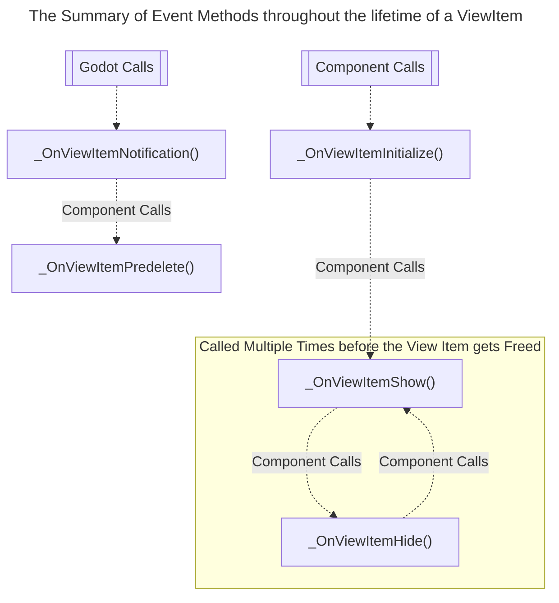

# GDViews.VirtualGridView [Work in Progress]

[](https://github.com/Delsin-Yu/GDViews.VirtualGridView/releases/latest) [](https://www.nuget.org/packages/GDViews.VirtualGridView)  [](https://github.com/Delsin-Yu/GDViews.VirtualGridView/stargazers) [](https://github.com/Delsin-Yu/GDViews.VirtualGridView/blob/main/LICENSE)

## Introduction

Supports in `Godot 4.1+` with .Net module.  
***GDViews.VirtualGridView*** is a `Godot 4` UI Component that provides classes that's useful for creating highly customizable, fully virtualized list/grid views.

## Installation

For .Net CLI

```txt
dotnet add package GDViews.VirtualGridView
```

For Package Manager Console

```txt
NuGet\Install-Package GDViews.VirtualGridView
```

For `csproj` PackageReference

```xml
<PackageReference Include="GDViews.VirtualGridView" Version="*" />
```

---

<!-- START doctoc generated TOC please keep comment here to allow auto update -->
<!-- DON'T EDIT THIS SECTION, INSTEAD RE-RUN doctoc TO UPDATE -->
<!-- ## Table of Contents

- [Glossarys](#glossarys)
  - [`VirtualGridView / GridView`](#VirtualGridView--GridView)
  - [`VirtualGridViewItem / GridViewItem`](#VirtualGridViewitem--GridViewitem)
- [API Usage](#api-usage)
  - [Creating a `ViewItem`](#creating-a-viewitem)
    - [A Simple Example](#a-simple-example)
    - [A Complex Example](#a-complex-example)
  - [Creating a `GridView`](#creating-a-GridView)
    - [Create from existing `ViewItem` Instances](#create-from-existing-viewitem-instances)
    - [Create from `PackedScenes`](#create-from-packedscenes)
- [Component Documentation](#component-documentation)
  - [The `VirtualGridView`](#the-VirtualGridView)
    - [Static Factory Methods](#static-factory-methods)
      - [`VirtualGridView.CreateFromPrefab`](#VirtualGridViewcreatefromprefab)
      - [`VirtualGridView.CreateFromInstance`](#VirtualGridViewcreatefrominstance)
    - [Instance Methods](#instance-methods)
      - [`Show(int index)` / `Show(int index, object? optionalArg)`](#showint-index--showint-index-object-optionalarg)
      - [`ShowNext` / `ShowPrevious`](#shownext--showprevious)
    - [`ArgumentResolver`](#argumentresolver)
      - [Default Resolver](#default-resolver)
      - [Resolver for `ShowNext` / `ShowPrevious`](#resolver-for-shownext--showprevious)
  - [The `VirtualGridViewItem` / `VirtualGridViewItemT`](#the-VirtualGridViewitem--VirtualGridViewitemt)
    - [Event Methods Diagram](#event-methods-diagram)
  - [ViewItemTweeners](#viewitemtweeners)
    - [Built-in Tweeners](#built-in-tweeners)
    - [Customize Tweeners](#customize-tweeners) -->

<!-- END doctoc generated TOC please keep comment here to allow auto update -->

---

## Glossarys

### `VirtualGridView / GridView`

The C# type that controls a group of associated `GridViewItem` and handles the all the necessary item virtualization, layout calculations, event method invoking, and input processing; it provides APIs that allow the developer to control the internal focused items, movement of virtual viewports and triggering redraws.

### `VirtualGridViewItem / GridViewItem`

The script(s) inheriting the or `VirtualGridViewItemT`, attaching the script to a control to make it a `GridViewItem`, this type contains all the necessary event method for customizing the visual behaviour of a `GridViewItem`, the developer should pass their implementation of `GridViewItem` PackedScene to the corresponding builder(mentioned below) when construct.

## API Usage

### Creating a `GridViewItem`

Attach the following script to a `Control` to make it a `GridViewItem`.  

#### Example

This time log view item displays the time for each log entry, and contains a button that allows user to remove the current entry when pressed.

```csharp
/// <summary>
/// The model that describes the data within each cell.
/// </summary>
/// <param name="ID">The data ID.</param>
/// <param name="CurrentTime">The time when adding the data.</param>
public record struct DataModel(int ID, DateTime CurrentTime);

/// <summary>
/// The type that handles logics related to per-virtualized grid element interactions, attach this script to a <see cref="Button"/> to make it a grid item.
/// </summary>
public partial class ExampleGridItem : VirtualGridViewItem<DataModel, ExampleMain>
{
    // Assigned from the inspector.
    [Export] private Label _id;
    [Export] private Label _time;
    [Export] private Button _deleteButton;

    /// <summary>
    /// Invoked when the internal data of the current virtualized grid element instance
    /// has changed (or initialized) and requires developer-implemented draw logic.
    /// </summary>
    /// <param name="data">The data of the current virtualized grid element instance.</param>
    protected override void _OnGridItemDraw(DataModel data, Vector2I _, ExampleMain __)
    {
        // Developer defined draw logic.
        _id.Text = data.ID.ToString("D2");
        _time.Text = data.CurrentTime.ToLongTimeString();
        
        // Bind the remove self method to the button
        _deleteButton.Pressed += RemoveSelf;
    }

    /// <summary>
    /// Invoked when the view controller is moving this
    /// virtualized grid element instance out from the viewport.
    /// </summary>
    protected override void _OnGridItemMoveOut(DataModel _, Vector2I __, ExampleMain ___)
    {
        // Unbind the remove self method from the button
        _deleteButton.Pressed -= RemoveSelf;
    }
    
    private void RemoveSelf()
    {
        // Do nothing if the current element is invalid (hidden or empty)
        if(!TryGetInfo(out var info)) return;
        
        // Do nothing if the associated value is null (moving out)
        if(info.ExtraArgument is null || info.Data == default) return;
        
        // Notify the controller to remove the data
        // associated to this element from the dataset, and performs a redraw. 
        info.ExtraArgument.RemoveEntry(info.Data);
    }
}
```

### Creating a `GridView`

The `VirtualGridView` is pure C# implementation, so instead of attaching a script to a node in the scene tree, developers need to create and reference it in scripts, due to the complexity of the creation process, `the builder design pattern` is used.


```csharp
/// <summary>
/// Attach this script to a node from the scene tree, and assigning the required exported fields.
/// </summary>
public partial class ExampleMain : Node
{
    [Export] private Button _addData;
    
    [Export] private PackedScene _itemPrefab;
    [Export] private Control _itemContainer;
    [Export] private Vector2 _itemSize;
    [Export] private Vector2 _itemSeparation;
    [Export] private ScrollBar _verticalScrollBar;

    private IVirtualGridView<DataModel> _virtualGridView;
    private readonly List<DataModel> _dataset = [];

    /// <summary>
    /// Called when the node is "ready", i.e. when both the node and its children have entered the scene tree.
    /// </summary>
    public override void _Ready()
    {
        _virtualGridView = 
    
            // Call the Create function under this static class to initiate a build.
            VirtualGridView
                // Here we are specifying the viewport dimensions
                .Create(viewportColumns: 1, viewportRows: 10)
                // Call the WithHandlers function to specifying the visual logic.
                .WithHandlers(
                
                    // Handles the positioning of the virtual viewport,
                    // side positioner does not move the viewport
                    // unless the selected item lies outside of the viewport.
                    elementPositioner: 
                    ElementPositioners.Side,
                    
                    // Manages the visual positional interpolation of the
                    // elements when user moves the virtualized viewport.
                    // pan tweener does position interpolation.
                    elementTweener: 
                    ElementTweeners.CreatePan(duration: 0.1f, tweenSetup: TweenSetups.EaseOut.Quad),
                    
                    // Manages the hiding and showing of the virtualized elements.
                    // fade fader does Modulate interpolation.
                    elementFader: 
                    ElementFaders.CreateFade(duration: 0.1f, tweenSetup: TweenSetups.EaseInOut.Sine)
                    
                )
                
                // Specifying the dataset positioning, developer may choose to
                // horizontally or vertically layout their dataset(s).
                // Here we choose to layout our data set vertically,
                // so it will show like:
                //
                //     [Column 0]
                //     [DataSet0]
                //    |    00    |
                //    |    01    |
                //    |    02    |
                //    |    03    |
                //    |    04    |
                //
                // Specifying the type of the dataset as well.
                .WithVerticalDataLayout<DataModel>()
                
                    // Append our dataset to the building datasets
                    // developer may append multiple datasets, under 
                    // the vertical data layout, it will show like:
                    //
                    //     [Column 0] [Column 1] [Column 2]
                    //     [DataSet0] [DataSet0] [DataSet1]
                    //    |    00    |    01    |    00    |
                    //    |    02    |    03    |    01    |
                    //    |    04    |    05    |    02    |
                    //    |    08    |    09    |    04    |
                    //    |    06    |    07    |    03    |
                    //                           ^^ +New ^^
                    //
                    // the developer may also choose to make one dataset
                    // to occupy multiple columns by increasing the repeat
                    // argument or add the same IDynamicGridViewer multiple times
                    .AppendColumnDataSet(
                    
                            // The dynamic grid viewer emulates a 2D list access
                            // from the backing list we passes in.
                            DynamicGridViewers.CreateList(_dataset)
                            
                        )
                // Call the WithArgument function to specifying the rest of the arguments.
                .WithArgument<ExampleGridItem, ExampleMain>(
                    
                    // The prefab that's used to create
                    // instances of the virtualized elements.
                    _itemPrefab,
                    
                    // The container for the virtualized elements.
                    // this container is also used for receiving inputs.
                    _itemContainer,
                    
                    // Infinite Layout Grid is the abstraction of a layout grid that has infinite amount of cells.
                    // simple infinite layout grid that has functions equivalent to a GridContainer.
                    InfiniteLayoutGrids.CreateSimple(
                        
                        // Size of one virtualized element.
                        _itemSize,
                        
                        // Separation between the elements
                        _itemSeparation
                        
                        )
                )
                
                    // Pass the current instance to the view
                    // so that we can get this instance from
                    // the virtualized instance
                    .ConfigureExtraArgument(this)
                
                    // The vertical scroll bar use to indicate
                    // the current viewport position relative to the
                    // data sets. Setting autohide to true will make the
                    // view hide the scroll bar when it's unnecessary.
                    .ConfigureVerticalScrollBar(_verticalScrollBar, autoHide: true)
                
                // Finish the build and get the built instance.
                .Build();

        // Press this button to add an entry to the dataset,
        // and triggers the view redraw.
        _addData.Pressed += AddEntry;
    }

    /// <summary>
    /// Add an entry to the dataset and triggers the redraw.
    /// </summary>
    private void AddEntry()
    {
        var id = _dataset.Count;
        var time = DateTime.Now;

        // Add to the dataset.
        _dataset.Add(new(id, time));
        
        // Make the view to redraw.
        _virtualGridView.Redraw();
        
        // Make sure we have a focus
        // (for platforms that do not have pointing device).
        _virtualGridView.GrabFocus();
    }

    /// <summary>
    /// Removes the specified value from the dataset and triggers the redraw.
    /// </summary>
    public void RemoveEntry(DataModel dataModelToRemove)
    {
        // Remove from the dataset.
        _dataset.Remove(dataModelToRemove);
        
        // Make the view to redraw.
        _virtualGridView.Redraw();
        
        // Make sure we have a focus
        // (for platforms that do not have pointing device).
        _virtualGridView.GrabFocus();
    }
}
```

<!-- ## Component Documentation

### The `VirtualGridView`

#### Static Factory Methods

Use factory functions to instantiate `VirtualGridViews`.

##### `VirtualGridView.CreateFromPrefab`

Create an instance of the `VirtualGridView` from the given `TabPrefabSetups`, this overload instantiates the given `PackedScenes` under the `viewsContainer`.

```csharp

[Export] private PackedScene _viewItem1;
[Export] private PackedScene _viewItem2;

[Export] private CheckButton _tab1;
[Export] private CheckButton _tab2;

_GridView = VirtualGridView.CreateFromPrefab(
    [
        new(_tab1, _viewItem1), 
        new(_tab2, _viewItem2), 
    ],
    _container
);
```

##### `VirtualGridView.CreateFromInstance`

Create an instance of the `VirtualGridView` from the given `TabPrefabSetups`, this overload references the given `IVirtualGridViewItems`.

```csharp

[Export] private PackedScene _viewItem1;
[Export] private PackedScene _viewItem2;

[Export] private CheckButton _tab1;
[Export] private CheckButton _tab2;

_GridView = VirtualGridView.CreateFromPrefab(
    [
        new(_tab1, _viewItem1), 
        new(_tab2, _viewItem2), 
    ],
    _container
);
```

#### Instance Methods

A `VirtualGridView` exposes four functions to the developer to switch between the `ViewItems`.

##### `Show(int index)` / `Show(int index, object? optionalArg)`

Shows a view item at the given index, the latter overload supports passing an optional argument to the target view item.

```csharp
// Shows the first view item.
_GridView.Show(0);

// Shows the second view item, 
// and pass the "Hello World" to its `_OnViewItemShow` method.
_GridView.Show(1, "Hello World");
```

##### `ShowNext` / `ShowPrevious`

Shows the next/previous view item. If no view item is shown at the moment, the first view item will be shown.  
The first argument determines if the `GridView` should warp to the first/last view item if the current shown view item is the last/first.

```csharp
// Shows the first view item.
_GridView.Show(0);

// Shows the previous view item.
_GridView.ShowPrevious();
_GridView.ShowNext();
```

#### `ArgumentResolver`

When using the `ShowNext`/`ShowPrevious` API or `CheckButtons` to switch between view items, it is hard to pass the argument to the displaying view items, in this case, the developer may pass an `argument resolver delegate` when constructing the `VirtualGridView` or to the `ShowNext`/`ShowPrevious` API.

##### Default Resolver

Passing a delegate with the following signature `Func<IVirtualGridViewItem, object?>` to the factory method as the default `ArgumentResolver`, this resolver gets called when calling `Show(0)`, `Show(0, null)`, `ShowPrevious()`, and `ShowNext()` API, the developer may write their logic to return the desired argument based on the given `IVirtualGridViewItem` instance.

```csharp
using Godot;

/// <summary>
/// Attached to a node in scene tree.
/// </summary>
public partial class Main : Node
{
    // Assigned in Godot Editor, through inspector.
    [Export] private MyViewItem _viewItem1;
    [Export] private MyViewItem2 _viewItem2;

    [Export] private CheckButton _tab1;
    [Export] private CheckButton _tab2;

    private VirtualGridView _GridView;

    public override void _Ready()
    {
        // Construct a tab view on ready.
        _GridView = VirtualGridView.CreateFromInstance(
            [
                // Associate a tab to its corresponding view item instance.
                new TabInstanceSetup(_tab1, _viewItem1), 
                new TabInstanceSetup(_tab2, _viewItem2), 
            ],
            ArgumentResolver
        );
        
        return;
        
        object? ArgumentResolver(IVirtualGridViewItem arg)
        {
            if (arg == _viewItem1) return "Hello World!";
            if (arg == _viewItem2) return 10;
            return null;
        }
    }
}
```

##### Resolver for `ShowNext` / `ShowPrevious`

Passing a delegate with the following signature `Func<IVirtualGridViewItem, object?>` to the `ShowPrevious()`, and `ShowNext()` API as the `ArgumentResolver`, the developer may write their logic to return the desired argument based on the given `IVirtualGridViewItem` instance. Passing null to these two APIs will fall back to the `default ArgumentResolver`.

```csharp
object? ArgumentResolver(IVirtualGridViewItem arg)
{
    if (arg == _viewItem1) return "Hello World!";
    if (arg == _viewItem2) return 10;
    return null;
}

_GridView.ShowPrevious(argumentResolver: ArgumentResolver);
_GridView.ShowNext(argumentResolver: ArgumentResolver);
```

### The `VirtualGridViewItem` / `VirtualGridViewItemT`

Inheriting the `VirtualGridViewItem` or `VirtualGridViewItemT` type, and attach the script to a `Control` node for it to work.

#### Event Methods Diagram

While working with `ViewItems`, certain methods get called at a certain lifetime of a view item, a brief diagram can be summarised as follows.



1. When calling one of the factory methods (`VirtualGridView.CreateFromInstance`/`VirtualGridView.CreateFromPrefab`), after the component has done basic initializing, the `_OnViewItemInitialize` method of each associated view item instance gets invoked.
2. When calling any of the `Show` APIs on a `GridView`, the tab view will call `_OnViewItemHide` on the currently shown view item and call `_OnViewItemShown` on the target view item.
3. A `GridViewItem` delegates the `_Notification` engine call to `_OnViewItemNotification`, and calls `_OnViewItemPredelete` when necessary.

### ViewItemTweeners

Developers may customize a view item's `visual transition behavior when showing/hiding` by accessing its `ViewItemTweener` property.

#### Built-in Tweeners

There are two preconfigured Tweenrs provided with the component.

1. NoneViewItemTweener: This tweener simply hides and shows the view items, it is also the default value of a `ViewItemTweener`, you may access the global instance of this tweener from `NoneViewItemTweener.Instance`.
2. FadeViewItemTweener: This tweener performs fade transition for the view items' showing and hiding, after instantiating the tweener, you may configure the transition time by accessing its `FadeTime` property.

#### Customize Tweeners

By inheriting the `IViewItemTweener` interface, the developer may customize their transition effects.

```csharp
/// <summary>
/// Defines the behavior for view transitions.
/// </summary>
public interface IViewItemTweener
{
    /// <summary>
    /// This sets the default visual appearance for a view item.
    /// </summary>
    /// <param name="viewItem">The target view item.</param>
    /// <param name="additionalData">Optional additional data required by this tweener.</param>
    void Init(Control viewItem, ref object? additionalData);
    
    /// <summary>
    /// This async method manages the behavior when the view item is showing up.
    /// </summary>
    /// <param name="viewItem">The target view item.</param>
    /// <param name="additionalData">Optional additional data required by this tweener.</param>
    void Show(Control viewItem, object? additionalData);
    
    /// <summary>
    /// This async method manages the behavior when the view item is hiding out.
    /// </summary>
    /// <param name="viewItem">The target view item.</param>
    /// <param name="additionalData">Optional additional data required by this tweener.</param>
    void Hide(Control viewItem, object? additionalData);
}
``` -->
